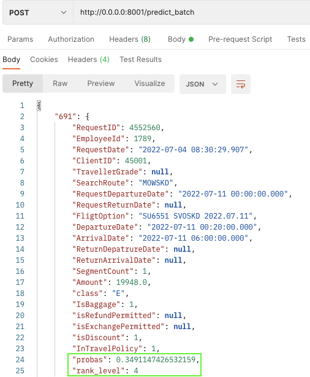

# Auto Avia Offer

# RU

### 1. Введение
-----

Целью проекта является создание системы ранжирования заявок (задание из хакатона [Aeroclub
Challenge 2023](https://codenrock.com/contests/aeroclub-challenge-2023#/info))

По факту является задачей бинарной классификации (будет ли добавлено / выбрано предложение в список на отправку или нет)

### 2. Структура проекта
-----

- `notebooks` содержит скрипты исследования (.py формата):
  - `research`: разведочный анализ данных, очистка данных, построение новых признаков
  - `hack_submission`: пайплайн предсказания на тестовых данных
- `data` содержит .xlsx / .csv файлы с изначальными данными с хакатона, обработанные данные после построения новых признаков
- `service` содержит файлы FastAPI сервиса.
- `tests` содержит тестовый скрипт проверки для api сервиса.

### 3. Установка
-----

Убедитесь, что у Вас установлен Docker на локальной машине. В случае отсутствия, перейдите
[сюда](https://docs.docker.com/get-docker/) и проследуйте по инструкции.
Затем перейдите в командую строку и выполните следующие команды:

1. <code>git clone https://github.com/unknowngfonovich/avia_hack_2023.git</code>
2. Перейдите в каталог `/service`
3. Создайте `.env` файл с двумя переменными (без символов <>)

    `SERVICE_HOST`=<адрес хоста, обычно, 0.0.0.0>

    `SERVICE_PORT`=<порт, например, 8001>

4. В командой строке наберите следующую команду

   <code>docker build -t ranking_service .</code>

### 4. Запуск
-----

Перейдите в командую строку и выполните следующую команду:

<code>docker run --rm -d --env-file .env -p 8001:8001 ranking_service</code>

### 5. Пример использования
-----

Если у вас есть Postman, выполните POST запрос к `http://0.0.0.0:8001/predict_batch` с содержимым `test_request.json` из `test/service_api_test`

В ответ вы получите исходные данные с вероятностью и рангом (позицией) в выдаче внутри одного `RequestID`

# EN

### 1. Intro
-----

The aim of project is creating an offer ranking service (task from hack [Aeroclub
Challenge 2023](https://codenrock.com/contests/aeroclub-challenge-2023#/info))

In fact, it is a binary classification task (whether an offer will be added/selected to the list for submission or not)

### 2. Project structure
-----

- `notebooks` contains script (.py format):
  - `research`: EDA, data cleaning, feature engineering
  - `hack_submission`: pipeline of submission
- `data` contains .xlsx / .csv files with initial data from hack, processed data after feature engineering
- `service` contains core of FastAPI service.
- `requirements.txt` is list of necessary packages
- `tests` contains test script for service api.

### 3. Installation
-----

Be sure that Docker is installed on your local machine. If not, go [there](https://docs.docker.com/get-docker/) and do following instructions. Then go to command line and execute commands:

1. <code>git clone https://github.com/unknowngfonovich/avia_hack_2023.git</code>
2. Go to `/service` folder
3. Create `.env` file with two variables (without symbols <>)

    `SERVICE_HOST`=<host adress, usually, 0.0.0.0>

    `SERVICE_PORT`=<port, e.g., 8001>

4. <code>docker build -t ranking_service .</code>

### 4. Running
-----

Just go to command line and type next command:

<code>docker run --rm -d --env-file .env -p 8001:8001 ranking_service</code>

### 5. Examples of usage
-----

If you have Postman try to make POST request to `http://0.0.0.0:8001/predict_batch` with body from `test_request.json` from `test/service_api_test`

You will recieve JSON with proba (if offer is likely to be sent) and ranking level within a single `RequestID` (position).

